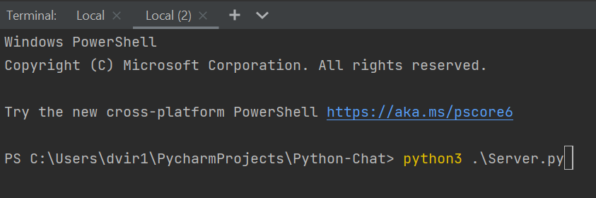
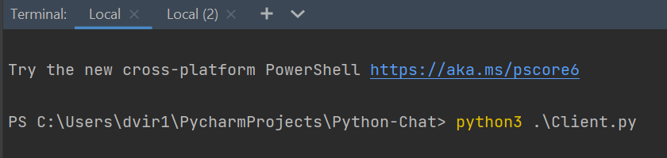

# Python-Chat

## Written by Ohad Shirazi & Dvir Biton.

## PROJECT EXPLANATION

In this task we were required to build a chat system with principles of communication protocols.
When the uniqueness of the chat is when we transfer files by implementing the udp protocol with the principles of tcp.

##classs:

### Client

#### Fields:
* Nickname
* Gui play
* Running
* Users
#### Functions:
* Gui loop - This method is the gui loop for the chat.
* Stop - This method close the chat for a client
and also close the socket of the client.
* Receive - This method handle the incoming messages in the client gui.
* Write - This method handle the outgoing messages in the client gui.
* Open_udp_sock - This method open a udp socket for the client in order to download a file.
* Download_file - This method downloading a file got from the server.
### Server
#### Fields:
* Nicknames_list
* Files_list
* Files_names
* Data names
* Host
* Port tcp
* Port udp

#### Functions:
* Start Chat - This method allows the clients to connect the chat
and append them to the clients list.
* Send Msg - This method broadcast the message of each client to the chat.
* Send Msg To Someone - This method broadcast the message of a specific client to other client.
* Send - This method handle the incoming messages.
* Download File -This method sends the file to the client
using the udp socket with realible principles (FAST reliable UDP).

## Algorithms

## GUI
This classes generate a windows that show the chat(we use tkinter).

## How to run the project
Open the folder of the project and write this line in the terminal command:
(The server and the client work on your local host and because of that you don't need to write your ip address).
Any command you need you write in separate terminal.
For this project you need in your computer: python, tkinter, tqdm.
To install tkinter write this command in the terminal(for Ubuntu).
* sudo apt-get install python3-tk

To install tqdm write this command in the terminal(for python3).
* pip3 install tqdm

Then in separate terminals write this commands:
* python3 Server.py

* python3 Client.py

